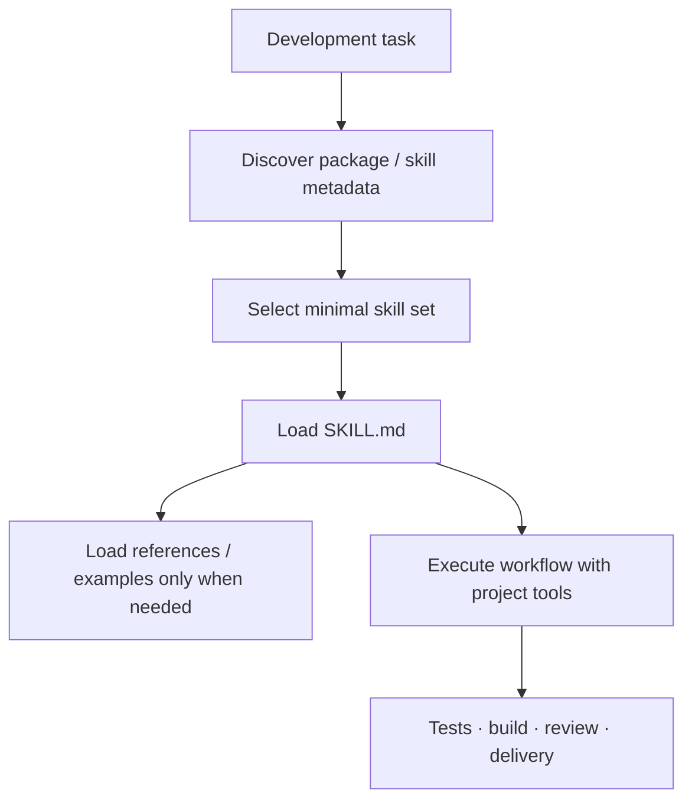

# Ecosystem architecture and boundaries

This diagram describes repository and runtime responsibilities. It does not imply that every node is a stable release; check the catalog for status.

## Verified boundaries

- The 45 public packages currently contain 564 local `SKILL.md` files; older 42/460/454 counts are obsolete.
- The former monorepo is split into independent repositories so users install only the domains they need.
- Skills are not runtime dependencies; they give agents workflows, constraints, references, scripts, and assets.

## Suggested reading order

1. Find the entry point closest to your use case in the diagram.
2. Confirm whether the repository is public, a private preview, or archived.
3. Open its README and confirm API, version, tests, and license.
4. Run the smallest verification from Getting Started before business integration.
