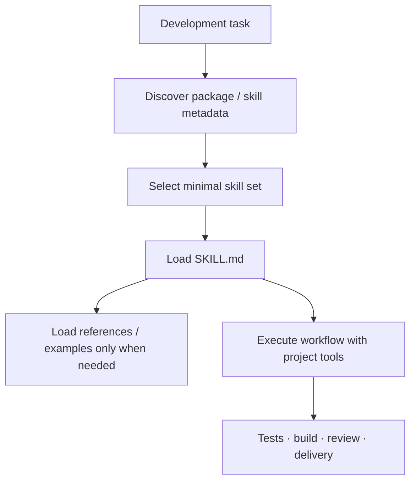

# 生态架构与边界

这张图描述的是仓库和运行时的职责关系，不代表所有节点都已达到稳定发布状态。状态请回到项目目录逐项确认。

## 已验证的边界

- 当前 45 个公开技能包，共 564 个本地 `SKILL.md`；旧页面的 42/460/454 均已过时。
- 大包已拆为独立仓库，用户只安装所需领域，降低上下文占用与版本耦合。
- 技能不是运行时依赖：它们为 Agent 提供工作流、约束、参考资料、脚本和资产。

## 阅读顺序

1. 先从图中找到与你的用例最接近的入口。
2. 在项目目录确认该仓库是公开、private preview 还是已归档。
3. 进入目标仓库 README，核对 API、版本、测试与许可证。
4. 按快速开始执行最小验证，再进入业务集成。
